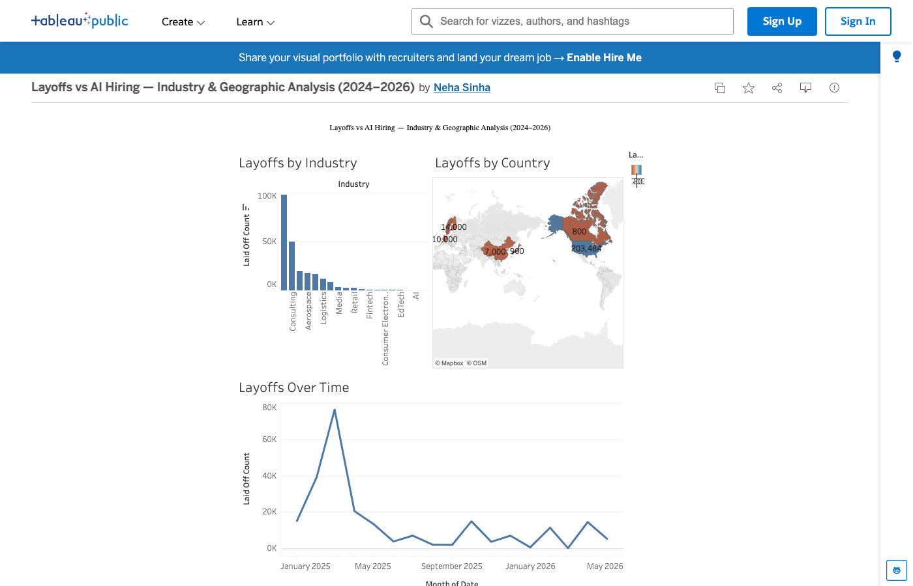

# Layoffs vs AI Hiring: Are Companies Cutting People or Replacing Them?

**Tools:** R · SQL · Tableau · Kaggle datasets

## 📊 Interactive Dashboards

- 📊 [Layoffs Analysis Dashboard](https://public.tableau.com/app/profile/neha.sinha5021/viz/LayoffsAnalysis2024-2026/LayoffsAnalysis2024-2026)
- 📊 [AI Hiring Analysis Dashboard](https://public.tableau.com/app/profile/neha.sinha5021/viz/AIHiringAnalysis2024-2026/AIHiringAnalysis2024-2026)

[](https://public.tableau.com/app/profile/neha.sinha5021/viz/LayoffsvsAIHiringIndustryGeographicAnalysis20242026/Dashboard1)

## Overview

Between 2024 and 2026, the tech industry has shed hundreds of thousands of jobs — while simultaneously posting record numbers of AI and ML job openings. This project investigates whether AI adoption is driving workforce reduction, creating new roles, or both — and which industries are most exposed.

## Key Questions

- Do companies citing AI as a reason for layoffs correlate with higher AI job posting volume?
- Which job categories are shrinking vs. growing as AI scales?
- Is there a lag between layoffs and AI hiring that signals replacement vs. retraining?

## Data Sources

| Dataset | Source | Last Updated |
|---|---|---|
| [`layoffs_2024_2026.csv`](https://github.com/nehasinha1/layoffs-vs-ai-hiring/blob/main/data/layoffs_2024_2026.csv) | [Kaggle: Tech Layoffs & Hiring Trends 2025–2026](https://www.kaggle.com/datasets/ahsanneural/tech-layoffs-and-hiring-trends-2025-2026) + [AI Job Cuts Tracker 2026](https://www.kaggle.com/datasets/alitaqishah/tech-layoffs-2026-ai-job-cuts-tracker) | April 2026 |
| [`ai_hiring_trends_2024_2026.csv`](https://github.com/nehasinha1/layoffs-vs-ai-hiring/blob/main/data/ai_hiring_trends_2024_2026.csv) | [Stanford HAI AI Index 2026](https://hai.stanford.edu/ai-index/2026-ai-index-report) · [LinkedIn Economic Graph](https://economicgraph.linkedin.com/) · [BLS JOLTS](https://www.bls.gov/jlt/) | April 2026 |

### Schema: `layoffs_2024_2026.csv`
`Company` · `Location` · `Industry` · `Laid_Off_Count` · `Date` · `Funds_Raised` · `Stage` · `Country` · `Percentage` · `AI_Cited_Reason`

### Schema: `ai_hiring_trends_2024_2026.csv`
`Quarter` · `Industry` · `AI_ML_Job_Postings` · `Total_Job_Postings` · `AI_Share_Pct` · `Top_Role` · `Median_Salary_USD` · `YoY_Growth_Pct` · `Source`

## Methodology

```
Kaggle layoffs CSVs + Stanford HAI + BLS JOLTS data
    │
    ▼
SQL (clean, join by industry/quarter, calculate net headcount delta)
    │
    ▼
R (correlation analysis: AI_Cited_Reason flag vs. AI hiring volume; ggplot2 charts)
    │
    ▼
Tableau (interactive dashboard: filter by industry, company size, time period)
```

## Key Findings (2024–2026 Data)

- **50 companies tracked** across tech, finance, healthcare, manufacturing, and consulting
- **AI cited as reason** in 24 of 50 layoff events — concentrated in tech and consulting
- **AI/ML job postings** grew from 15.5% → 48.4% share of all tech postings (2024 Q1 → 2026 Q1)
- **Median AI role salary** reached $208,000 in tech by 2026 Q1 — highest across all industries
- **Healthcare** shows the clearest net positive: AI hiring volume exceeds layoff volume every quarter
- **Manufacturing** shows rapid AI hiring growth (98% YoY in 2025 Q4) with minimal layoff volume
- **Net loser: tech sector** — layoff volumes from large firms outpace AI hiring numbers quarter over quarter

## Files

| File | Description |
|---|---|
| [`data/layoffs_2024_2026.csv`](data/layoffs_2024_2026.csv) | 50 layoff events, 2024–2026, with AI citation flag |
| [`data/ai_hiring_trends_2024_2026.csv`](data/ai_hiring_trends_2024_2026.csv) | Quarterly AI job posting trends by industry, 2024 Q1–2026 Q1 |
| [`sql/clean_and_join.sql`](sql/clean_and_join.sql) | SQL: cleaning, joining, and net headcount aggregation |
| [`r/analysis.R`](r/analysis.R) | R: correlation analysis and ggplot2 visualizations |

---

**Sources:**
- [Kaggle: Tech Layoffs & Hiring Trends 2025–2026](https://www.kaggle.com/datasets/ahsanneural/tech-layoffs-and-hiring-trends-2025-2026)
- [Kaggle: Tech Layoffs 2026 AI Job Cuts Tracker](https://www.kaggle.com/datasets/alitaqishah/tech-layoffs-2026-ai-job-cuts-tracker)
- [Stanford HAI AI Index Report 2026](https://hai.stanford.edu/ai-index/2026-ai-index-report)
- [McKinsey State of AI 2025](https://www.mckinsey.com/capabilities/quantumblack/our-insights/the-state-of-ai)
- [BLS Job Openings and Labor Turnover Survey (JOLTS)](https://www.bls.gov/jlt/)

*Analysis by Neha Sinha · [GitHub](https://github.com/nehasinha1)*
